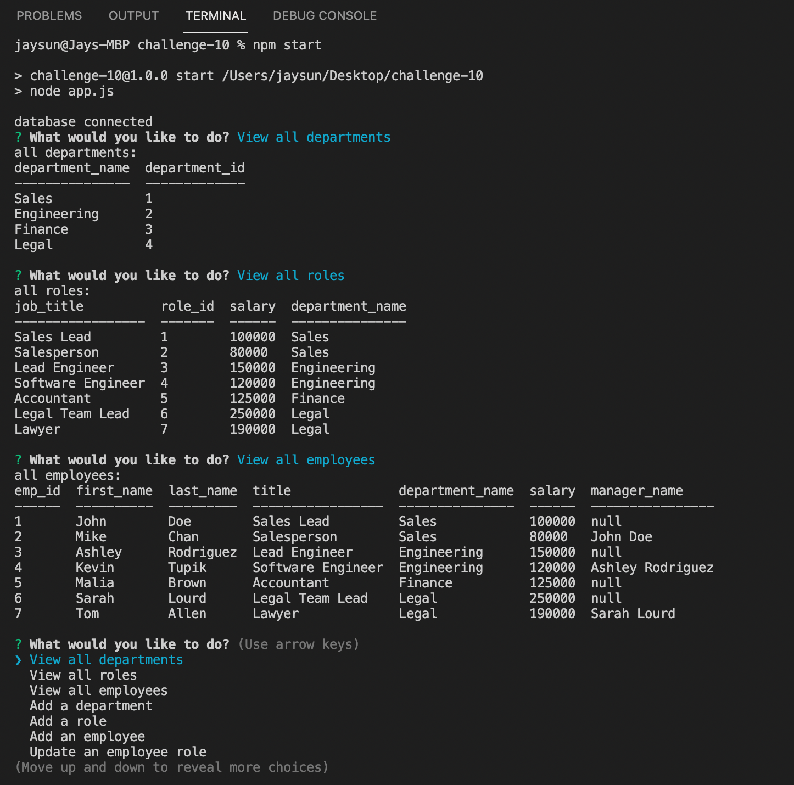
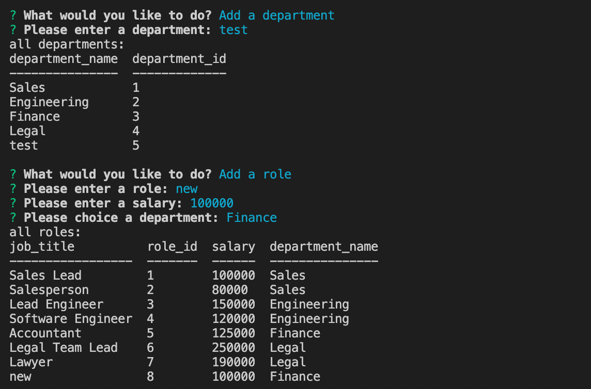
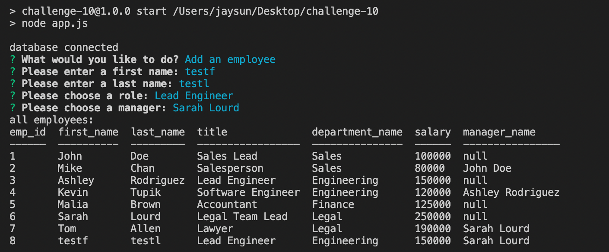
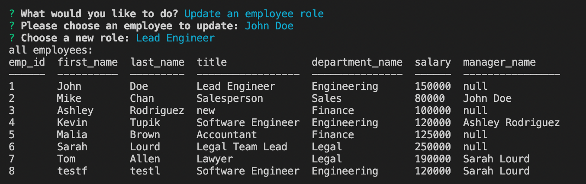

# Employee Tracker

[![Contributors][contributors-shield]][contributors-url]
[![Forks][forks-shield]][forks-url]
[![Stargazers][stars-shield]][stars-url]
[![Issues][issues-shield]][issues-url]
[![MIT License][license-shield]][license-url]

<!-- PROJECT LOGO -->
<br />
<p align="center">
  <a href="https://github.com/jsun994/track-emp-pro">
    
  </a>

  <p align="center">
  A professional employee tracker.
    <br />
    <a href="https://github.com/jsun994/track-emp-pro"><strong>Explore the docs »</strong></a>
    <br />
    <br />
    <a href="https://drive.google.com/file/d/1SXeDOHdQaq-27XR8ygquin9twIO6iLGF/view">View Demo</a>
    ·
    <a href="https://github.com/jsun994/track-emp-pro/issues">Report Bug</a>
    ·
    <a href="https://github.com/jsun994/track-emp-pro/issues">Request Feature</a>
  </p>
</p>

<!-- TABLE OF CONTENTS -->
<details open="open">
  <summary><h2 style="display: inline-block">Table of Contents</h2></summary>
  <ol>
    <li>
      <a href="#about-the-project">About The Project</a>
      <ul>
        <li><a href="#built-with">Built With</a></li>
      </ul>
    </li>
    <li>
      <a href="#getting-started">Getting Started</a>
      <ul>
        <li><a href="#prerequisites">Prerequisites</a></li>
        <li><a href="#installation">Installation</a></li>
      </ul>
    </li>
    <li><a href="#usage">Usage</a></li>
    <li><a href="#contributing">Contributing</a></li>
    <li><a href="#contact">Contact</a></li>
  </ol>
</details>

<!-- ABOUT THE PROJECT -->
## About The Project


Demo Video - [Screencastify - Google Drive](https://drive.google.com/file/d/1SXeDOHdQaq-27XR8ygquin9twIO6iLGF/view)

### Built With

* NodeJS
* mySQL2
* Inquirer
* cTable

<!-- GETTING STARTED -->
## Getting Started

To get a local copy up and running follow these simple steps.

### Prerequisites

This is an example of how to list things you need to use the software and how to install them.
* npm
  ```sh
  npm install npm@latest -g
  ```

### Installation

1. Clone the repo
   ```sh
   git clone git@github.com:jsun994/track-emp-pro.git
   ```
2. Install NPM packages
   ```sh
   npm install
   ```

<!-- USAGE EXAMPLES -->
## Usage

    GIVEN a command-line application that accepts user input
    WHEN I start the application
    THEN I am presented with the following options: view all departments, view all roles, view all employees, add a department, add a role, add an employee, and update an employee role
    WHEN I choose to view all departments
    THEN I am presented with a formatted table showing department names and department ids
    WHEN I choose to view all roles
    THEN I am presented with the job title, role id, the department that role belongs to, and the salary for that role
    WHEN I choose to view all employees
    THEN I am presented with a formatted table showing employee data, including employee ids, first names, last names, job titles, departments, salaries, and managers that the employees report to
    WHEN I choose to add a department
    THEN I am prompted to enter the name of the department and that department is added to the database
    WHEN I choose to add a role
    THEN I am prompted to enter the name, salary, and department for the role and that role is added to the database
    WHEN I choose to add an employee
    THEN I am prompted to enter the employee’s first name, last name, role, and manager and that employee is added to the database
    WHEN I choose to update an employee role
    THEN I am prompted to select an employee to update and their new role and this information is updated in the database 





<!-- CONTRIBUTING -->
## Contributing

1. Fork the Project
2. Create your Feature Branch (`git checkout -b feature/AmazingFeature`)
3. Commit your Changes (`git commit -m 'Add some AmazingFeature'`)
4. Push to the Branch (`git push origin feature/AmazingFeature`)
5. Open a Pull Request

<!-- CONTACT -->
## Contact

Jay Sun - jaysun054@gmail.com

[contributors-shield]: https://img.shields.io/github/contributors/jsun994/track-emp-pro.svg?style=for-the-badge
[contributors-url]: https://github.com/jsun994/track-emp-pro/graphs/contributors
[forks-shield]: https://img.shields.io/github/forks/jsun994/track-emp-pro.svg?style=for-the-badge
[forks-url]: https://github.com/jsun994/track-emp-pro/network/members
[stars-shield]: https://img.shields.io/github/stars/jsun994/track-emp-pro.svg?style=for-the-badge
[stars-url]: https://github.com/jsun994/track-emp-pro/stargazers
[issues-shield]: https://img.shields.io/github/issues/jsun994/track-emp-pro.svg?style=for-the-badge
[issues-url]: https://github.com/jsun994/track-emp-pro/issues
[license-shield]: https://img.shields.io/github/license/jsun994/track-emp-pro.svg?style=for-the-badge
[license-url]: https://github.com/jsun994/track-emp-pro/blob/master/LICENSE.txt